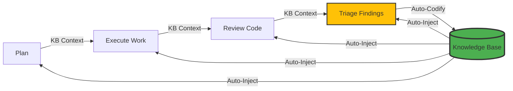

# Compounding Engineering Plugin (DSPy Edition)


A Python implementation of the [Compounding Engineering Plugin](https://github.com/EveryInc/compounding-engineering-plugin) using [DSPy](https://github.com/stanfordnlp/dspy).

[**📚 Documentation**](https://strategic-automation.github.io/dspy-compounding-engineering/)

## What Is Compounding Engineering?

**Each unit of engineering work should make subsequent units of work easier—not harder.**

This CLI tool provides AI-powered development tools for code review, planning, and workflow automation, following the compounding engineering philosophy. It is designed as a **Local-First** tool that runs on your machine, keeping your code secure while leveraging powerful LLMs.

## Features

- **🎨 Friday CLI**: Interactive AI coding assistant with beautiful terminal UI
  - **Conversational Interface**: Natural language interactions with persistent context
  - **Theme System**: Choose from dark, light, or high-contrast themes
  - **Rich UI**: Icons, colors, tables, and adaptive banner
  - **Smart Prompts**: Turn counter and context awareness
  - **Git Integration**: Branch display and status tracking
  - **Configurable**: CLI flags, environment variables, or config file

- **🧠 Compounding Engineering**: True learning system where every operation makes the next one easier
  - **Auto-Learning**: Every todo resolution automatically codifies learnings
  - **KB Auto-Injection**: Past learnings automatically inform all AI operations
  - **Pattern Recognition**: Similar issues are prevented based on past resolutions
  - **Knowledge Accumulation**: System gets smarter with every use

- **🔍 Multi-Agent Code Review**: Run 10+ specialized review agents in parallel
  - **Security Sentinel**: Detects vulnerabilities (SQLi, XSS, etc.)
  - **Performance Oracle**: Identifies bottlenecks and O(n) issues
  - **Architecture Strategist**: Reviews design patterns and SOLID principles
  - **Data Integrity Guardian**: Checks transaction safety and validation
  - **KB-Augmented**: All agents benefit from past code review learnings
  - And many more...

- **🤖 ReAct File Editing**: Intelligent file operations with reasoning
  - **Smart Tools**: List, search, read ranges, and edit specific lines
  - **Iterative Reasoning**: Think → Act → Observe → Iterate pattern
  - **Zero Hallucination**: Direct file manipulation, not text generation

- **🛡️ Secure Work Execution**: Safely execute AI-generated plans
  - **Isolated Worktrees**: Optional `--worktree` mode for safe parallel execution
  - **Parallel Processing**: Multi-threaded todo resolution with `--workers`
  - **Flexible Modes**: In-place (default) or isolated worktree execution
  - **Auto-Codification**: Every resolution creates learnings for future use

- **📋 Smart Planning**: Transform feature descriptions into detailed plans
  - Repository research & pattern analysis
  - Framework documentation integration
  - SpecFlow user journey analysis
  - **KB-Informed**: Plans leverage past architectural decisions

- **✅ Interactive Triage**: Manage code review findings
  - **Batch Operations**: Approve multiple findings at once
  - **Smart Priorities**: Auto-detection of P1/P2/P3 severity
  - **Work Logs**: Tracks decisions and rationale automatically
  - **KB-Augmented**: Triage decisions informed by past patterns

## Installation

### Prerequisites

Install [uv](https://github.com/astral-sh/uv) (fast Python package installer):

```bash
curl -LsSf https://astral.sh/uv/install.sh | sh
```

### Setup

```bash
# Clone repository
git clone https://github.com/Strategic-Automation/dspy-compounding-engineering.git
cd dspy-compounding-engineering

# Configure environment
cp .env.example .env
# Edit .env with your API keys (OpenAI, Anthropic, or Ollama)

# Install dependencies
uv sync
```

### Temporary runner: `uvx`

The repository includes a small wrapper script `uvx` that runs the CLI via `uv run` without doing a global install. It's useful for quickly trying commands locally:

```bash
./uvx -h
./uvx generate-command "create a command to list large files"
```

The script is in the repository root and is executable; run it from the repo directory.

You can also prefix commands with `compounding`, for example `./uvx compounding generate-command`.

### Friday Interactive CLI

Friday provides a conversational interface to all compounding workflows with an enhanced terminal experience:

```bash
# Start Friday with default settings
python -m friday.app
# or simply:
friday

# Customize the experience
friday --theme light              # Use light theme (dark, light, hc)
friday --minimal                  # Minimal banner
friday --no-banner                # Skip banner entirely
friday --ascii compact            # Choose ASCII art variant

# Configure via environment variables
export FRIDAY_THEME_PROFILE=dark  # Theme: dark, light, or hc (high-contrast)
export FRIDAY_MINIMAL=1           # Minimal mode
export FRIDAY_NO_BANNER=1         # Disable banner
export FRIDAY_DEBUG=1             # Enable debug mode

# Or use config file at ~/.friday/config.json
{
  "theme": "dark",
  "banner": {
    "enabled": true,
    "minimal": false,
    "ascii": "compact"
  }
}
```

**Friday Features:**
- 🎨 **Beautiful Themes**: Dark (default), light, and high-contrast profiles
- 📊 **Rich Tables**: Status displays with icons and proper formatting
- 🔧 **Interactive Commands**: Autocomplete and command suggestions
- 💬 **Persistent Context**: Conversation history across sessions
- 📁 **Git Integration**: Branch display and file tracking
- 🎯 **Smart Prompts**: Turn counting with color-coded context warnings
- 🚀 **All Workflows**: Access planning, review, triage, and work execution

**Common Friday Commands:**
```
/help                      Show all commands
/plan <description>        Generate implementation plans
/work <pattern>            Execute tasks and todos
/review [target]           Review code changes
/triage                    Categorize findings
/codify <feedback>         Learn from feedback
/context                   Show current context
/history                   View conversation history
/clear                     Clear conversation
```

**Example Session:**
```
project #1 › /plan Add user authentication with JWT tokens
project #2 › /work auth
project #3 › Tell me about the changes made
project #4 › /review
```

## Example run

Quick example using the temporary runner `uvx` to see the `generate-command` help:

```bash
./uvx generate-command -h
```

Expected excerpt:

```
Usage: cli.py generate-command [OPTIONS] DESCRIPTION

Generate a new CLI command from a natural language description.

Options:
  --dry-run  -n   Show what would be created without writing files
  --help     -h   Show this message and exit.
```

You can run other commands similarly, for example:

```bash
./uvx -h
./uvx review --project
```

## The Compounding Engineering Loop

This implementation embodies the core philosophy: **each unit of work makes subsequent work easier**.



**How it works:**

1. **Auto-Injection**: All AI operations (`review`, `triage`, `plan`, `work`) automatically receive relevant past learnings
2. **Auto-Codification**: Every todo resolution automatically extracts and stores learnings
3. **Pattern Recognition**: The system identifies similar issues and suggests solutions based on past successes
4. **Continuous Improvement**: The more you use it, the smarter it gets

### Knowledge Base Features

- **Persistent Learning**: Learnings stored in `.knowledge/` as structured JSON
- **Smart Retrieval**: Keyword-based similarity matching (extensible to vector embeddings)
- **Auto-Documentation**: `AI.md` automatically updated with consolidated learnings
- **Tagged Search**: Filter learnings by category, source, or topic

## Roadmap

See our [detailed Roadmap](https://strategic-automation.github.io/dspy-compounding-engineering/roadmap/) for upcoming features.

Key focus areas:
- **GitHub Integration**: Create Issues, post PR comments, manage Projects
- **Vector Embeddings**: Upgrade from keyword matching to semantic similarity
- **Auto-Triage**: Pattern-based auto-approval/rejection of similar findings
- **Learning Analytics**: Dashboard showing knowledge growth and reuse

## Configuration

Edit `.env` to configure your LLM provider:

```bash
# OpenAI
DSPY_LM_PROVIDER=openai
DSPY_LM_MODEL=gpt-5.1-codex
OPENAI_API_KEY=sk-...

# Anthropic
DSPY_LM_PROVIDER=anthropic
DSPY_LM_MODEL=claude-4-5-haiku
ANTHROPIC_API_KEY=sk-ant-...

# Ollama (Local)
DSPY_LM_PROVIDER=ollama
DSPY_LM_MODEL=qwen3

# OpenRouter (Multi-Model Access)
DSPY_LM_PROVIDER=openrouter
DSPY_LM_MODEL=x-ai/grok-4.1-fast:free
OPENROUTER_API_KEY=sk-or-...
```

## Usage

### 1. Review Code

Run a comprehensive multi-agent review on your current changes:

```bash
# Review latest local changes
uv run python cli.py review

# Review entire project (not just changes)
uv run python cli.py review --project

# Review a specific PR (requires gh cli)
uv run python cli.py review https://github.com/user/repo/pull/123
```

### 2. Triage Findings

Process the findings generated by the review:

```bash
uv run python cli.py triage
```

- **Yes**: Approve and convert to ready todo
- **Next**: Skip or delete
- **All**: Batch approve all remaining items
- **Custom**: Change priority or details

### 3. Work on Todos or Plans

Unified command for resolving todos or executing plans using ReAct agents:

```bash
# Resolve all P1 priority todos
uv run python cli.py work p1

# Resolve specific todo by ID
uv run python cli.py work 001

# Execute a plan file
uv run python cli.py work plans/feature.md

# Preview changes without applying (dry run)
uv run python cli.py work p1 --dry-run

# Use isolated worktree (safe parallel execution)
uv run python cli.py work p1 --worktree

# Control parallelization
uv run python cli.py work p2 --sequential  # Sequential execution
uv run python cli.py work p2 --workers 5   # 5 parallel workers
```

This will:

1. Auto-detect input type (todo ID, plan file, or pattern)
2. Use ReAct reasoning for intelligent file operations
3. Execute in-place (default) or in isolated worktree (`--worktree`)
4. Process todos in parallel (default) or sequentially (`--sequential`)
5. Mark todos as complete (`*-complete-*.md`)
6. Clean up worktrees automatically

### 4. Generate Commands

Generate shell commands from natural language descriptions:

```bash
# Generate a command
uv run python cli.py generate-command "find all Python files modified in the last week"

# Execute the generated command (use with caution)
uv run python cli.py generate-command "list large files" --execute
```

### 5. Plan New Features

Generate a detailed implementation plan:

```bash
uv run python cli.py plan "Add user authentication with OAuth"
```

### 6. Codify Learnings

Capture and codify learnings into the knowledge base:

```bash
uv run python cli.py codify "Always validate user input before database operations"
uv run python cli.py codify "Use factory pattern for agent creation" --source retro
```

## Architecture

The system is built on a layered architecture designed for modularity and compounding intelligence:

### 1. Interface Layer (CLI)
- **Entry Point**: `cli.py` uses `Typer` to provide a robust command-line interface.
- **Commands**: Maps user intents (e.g., `review`, `work`) to specific workflows.

### 2. Orchestration Layer (Workflows)
- **Logic**: Python scripts in `workflows/` orchestrate complex multi-step processes.
- **Responsibility**: Manages state, handles user interaction, and coordinates agents.
- **Key Workflows**:
    - **Unified Work**: Combines planning and execution using ReAct loops.
    - **Review Pipeline**: Parallelizes multiple specialized review agents.
    - **Triage System**: Manages findings and prioritizes work.

### 3. Intelligence Layer (DSPy Agents)
- **Signatures**: Declarative definitions of AI tasks in `agents/`.
- **Modules**: `dspy.Module` implementations that chain thoughts and actions.
- **Optimization**: Agents are optimized via DSPy teleprompters.

### 4. Knowledge Layer (Compounding Engine)
- **Storage**: JSON-based knowledge base in `.knowledge/`.
- **Retrieval**: `KBPredict` wrapper automatically injects relevant context into agent calls.
- **Learning**: `LearningExtractor` codifies outcomes from every task into reusable patterns.

### 5. Infrastructure Layer (Utilities)
- **Git Service**: Manages isolated worktrees for safe execution.
- **Project Context**: Efficiently gathers and token-limits codebase context.
- **Todo Service**: Standardizes the unit of work (Markdown-based todos).

## Philosophy

Based on the [Compounding Engineering](https://every.to/source-code/my-ai-had-already-fixed-the-code-before-i-saw-it) philosophy:

- **Plan → Delegate → Assess → Codify** (fully implemented)
- **Each unit of work makes subsequent work easier** (via KB auto-injection)
- **Systematic beats heroic** (automated learning and reuse)
- **Quality compounds over time** (system gets smarter with use)
- **Knowledge is automatically codified** (not optional)

## Comparison with Original Plugin

| Feature | Original Plugin | This DSPy Edition |
|---------|-----------------|-------------------|
| **Runtime** | Claude Code Plugin | Standalone Python CLI |
| **LLM** | Claude Only | OpenAI, Anthropic, Ollama |
| **Execution** | Direct File Edit | **Secure Git Worktrees** |
| **Integration**| GitHub App | Local-First CLI |
| **Learning** | Manual CLAUDE.md | **Automatic KB Injection** |
| **Codification** | Manual | **Automatic on every resolution** |

## Contributing

We welcome contributions! If you're looking for ways to help, please check out our [Issues on GitHub](https://github.com/Strategic-Automation/dspy-compounding-engineering/issues).

See [CONTRIBUTING.md](CONTRIBUTING.md) for detailed guidelines.

## License

MIT

## Credits

Original concept by [Kieran Klaassen](https://github.com/kieranklaassen) at [Every.to](https://every.to).
DSPy framework by [Stanford NLP Group](https://github.com/stanfordnlp/dspy).
